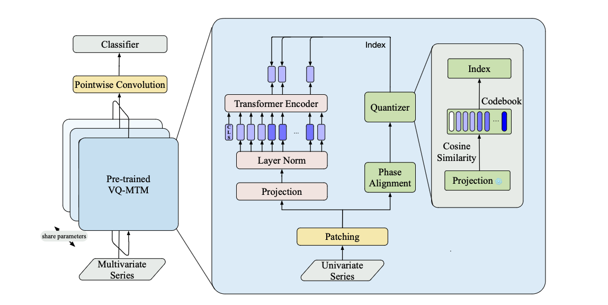

# A Vector Quantization Pretraining for EEG Time Series with Random Projection and Phase Alignment

**[Model]** We propose a BERT-style self-supervised learning model, VQ-MTM (Vector Quantization Masked Time-Series Modeling), for the EEG time series data analysis. At its core, VQ-MTM comprises a theoretically grounded random-projection quantization module and a phase-aligning module guided by the Time-Phase-Shift Equivariance of Fourier Transform, the two modules can generate well-defined semantic units (akin to words in natural language) for the corrupted and periodic time series, thus offering robust and consistent learning signals for the EEG self-supervised learning.
<p align="center">
    
</p>

**[Application]** Our model can be used for seizure classification and seizure detection, which is a two-stage methods by unsupervised pretraining on TUSZ/TUAB datasets and then fine-tuning on the same datasets.

## 0. Quick Start
- Preprocessing the Datasets
```bash
# process the ssl datasets
python preprocess/ssl_marker.py
# split the datasets into train/dev/eval
python preprocess/split_dataset.py
# preprocess the edf format to h5 format
python preprocess/resample_signal.py
```

- Run the Scipts
```bash
bash script/<Traing_Stage>/<Model_Name>.sh
```

## 1. Folder Structures
- **data_provider/**: contains the implements of the dataloader and the datasets, which contains
    - <u>The TUH Seizure EEG Corpus (TUSZ) </u>
    - <u>The TUH Abnormal EEG Corpus (TUAB)</u>

- **exp/**: contains the training & evaluation pipeline in the downstream tasks. which contains
    - <u>Self-supervised Learning</u>
    - <u>Classification</u>
    - <u>Anomaly Detection</u>

- **layers/**: contains the implement of the baseline models used in the experiments.

- **models/**: contains the implement of several baseline models, which contains
    - <u> VQ-MTM </u>
    - <u> BIOT </u>
    - <u> DCRNN </u>
    - <u> iTransformer </u>
    - <u> SimMTM </u>
    - <u> Ti-MAE </u>
    - <u> TimesNet </u>

- **preprocess/**: contains the basic preprocessing scripts

- **script/**: sh file to train & evaluate the model

## 2. Citations
```bibtex
@inproceeding{gui2024vqmtm,
    title={A Vector Quantization Pretraining Method for EEG Time Series with Random Projection and Phase Alignment},
    author={Gui, Haokun and Li, Xiucheng and Chen, Xinyang},
    booktitle={Forty-first International Conference on Machine Learning},
    year={2024},
    url={https://openreview.net/pdf?id=7uwLvFvpis}
}
```